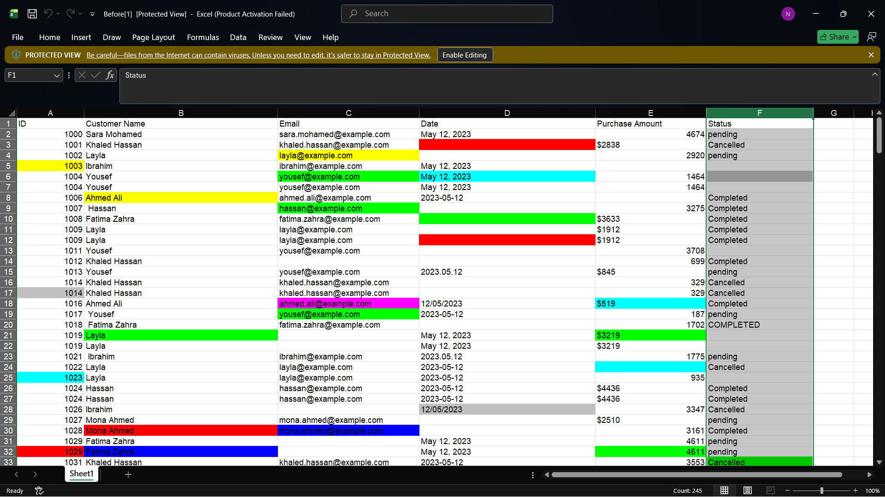
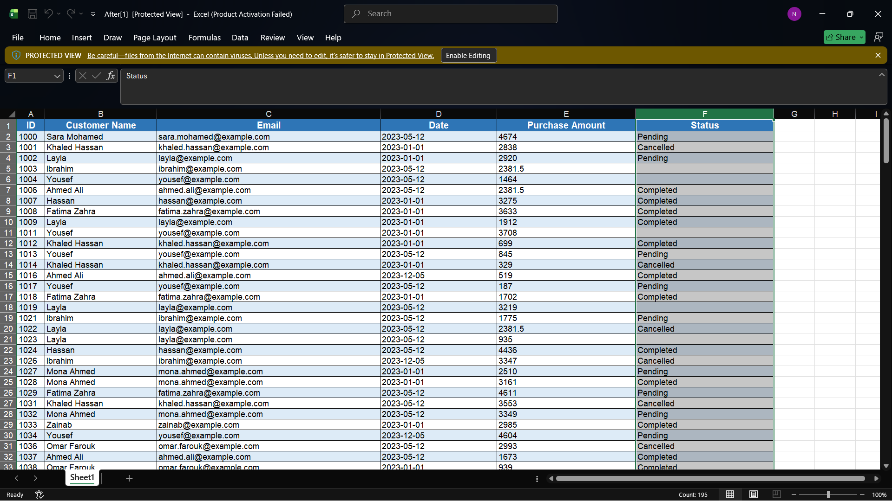
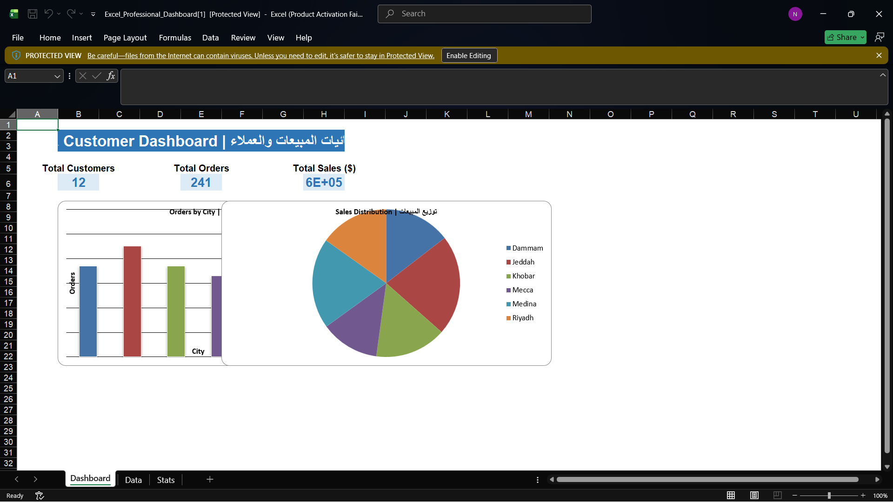

# Excel-Data-Entry-Portfolio
Professional Data Entry and Excel Portfolio
 📊 مشروع تنظيم وإدخال البيانات في Excel

 نبذة
يهدف هذا المشروع إلى عرض مهاراتي في إدخال البيانات، وتنظيفها، وتنسيقها باستخدام Microsoft Excel.

 الخدمات المنفذة
- إدخال البيانات
- تنظيف البيانات
- إزالة التكرارات
- تنسيق الجداول
- تنظيم البيانات
- تجهيز البيانات للتحليل

 الأدوات المستخدمة
- Microsoft Excel
- CSV

 معرض العمل

 قبل التنظيم

 بعد التنظيم

 لوحة المعلومات

 الملفات
- بيانات قبل التنظيم
- بيانات بعد التنظيم
- ملف CSV
